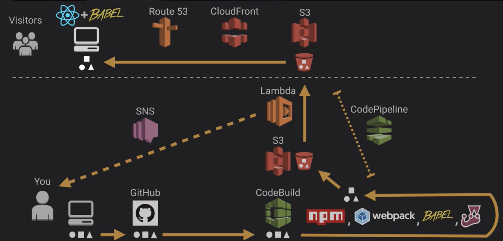

# serverless-portfolio
Creating a serverless application with AWS and ReactJS.
Inspired by the online course by [acloud.guru](https://acloud.guru) this is an introduction to ReactJS development, developed and built with a 'serverless' workflow. The technical portfolio utilises technologies, frameworks and services
including ReactJS, babel, jest, enzyme, python and an array of AWS services. The source code is openely available on [github.com/pearcem0](https://www.github.com/pearcem0/serverless-portfolio).

# Usage
`npm install`

`npm test`

`npm run webpack` - see [webpack repo](https://github.com/yhat/ws) for installation and more info.

Server the content:
`ws` [ws repo](https://github.com/yhat/ws)
or `local-web-server` [npm package](https://www.npmjs.com/package/local-web-server)
or `serve` [npm package](https://www.npmjs.com/package/serve)

Open _index.html_

# Technologies used
## Local workstation
* Brew
* git & github
* ssh
* ws - a Node.js WebSocket library

## Web-dev
* HTML
* CSS
* Python
* Font Awesome
* Google Fonts
* babel
* ReactJS
* NPM

## Amazon Web Services (AWS)
* Amazon S3
* Amazon SNS
* AWS Codebuild
* AWS CodePipeline
* AWS Lambda

# Testing
* Chai
* Mocha
* Jest
* Enzyme
